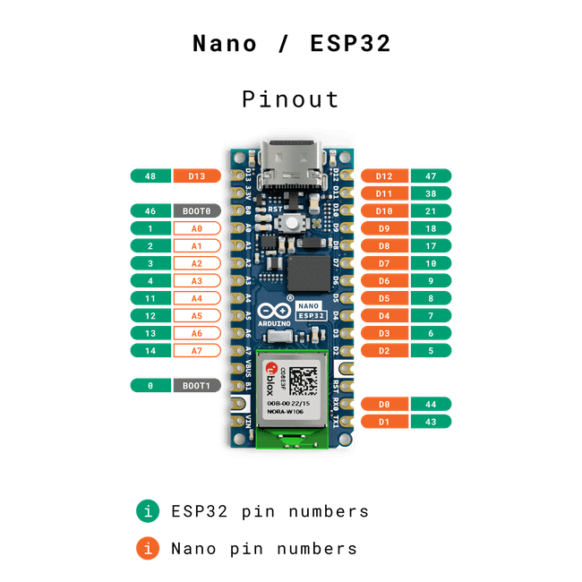

# Arduino Display

This is a simple Arduino project that uses various displays to show information.

## Setup

1. [Clone this repository](https://github.com/EricNeiman/arduinoDisplay.git)
2. Install [Visual Studio Code](https://code.visualstudio.com/)
3. Install [PlatformIO IDE Extension](https://marketplace.visualstudio.com/items?itemName=platformio.platformio-ide) in Visual Studio Code
4. Optionally install [Arduino IDE](https://www.arduino.cc/en/software) if you experience issues uploading to the board.
5. Follow the [PlatformIO VSCode Guide](https://docs.platformio.org/en/latest/integration/ide/vscode.html) to setup environment

## Materials Needed

1. [Arduino Nano ESP32](https://docs.arduino.cc/tutorials/nano-esp32/cheat-sheet/)
  - Code Examples can be found [here](https://github.com/arduino/arduino-esp32)

## Deployment

1. Build the project ctrl+alt+b

## Next Steps

1. Fully implement the I2C display OLED Display following the Last Minute Engineers [tutorial](https://lastminuteengineers.com/oled-display-arduino-tutorial/)
2. Implement an SPI display.
